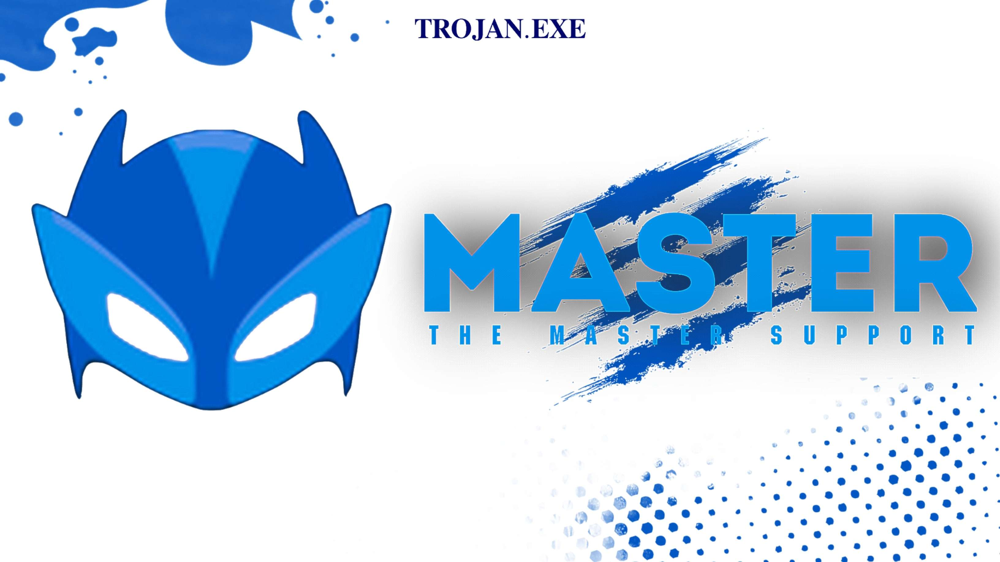

### Hi everyone ✨

<!--
**Master-dev-Centre/Master-Dev-Centre** is a ✨ _special_ ✨ repository because its `README.md` (this file) appears on your GitHub profile.

Here are some ideas to get you started:

**- 🔭 I’m currently working on ...
**- 🌱 I’m currently learning ...
**- 👯 I’m looking to collaborate on ...
**- 🤔 I’m looking for help with ...
**- 💬 Ask me about ...
**- 📫 How to reach me: ...
**- 😄 Pronouns: ...
**- ⚡ Fun fact: ...
-->
